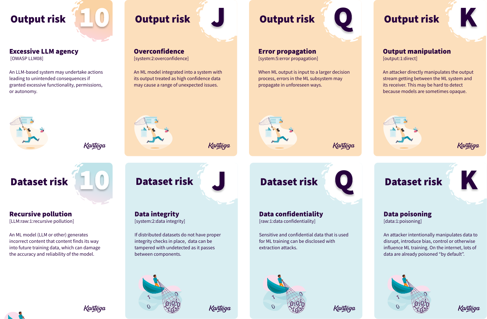
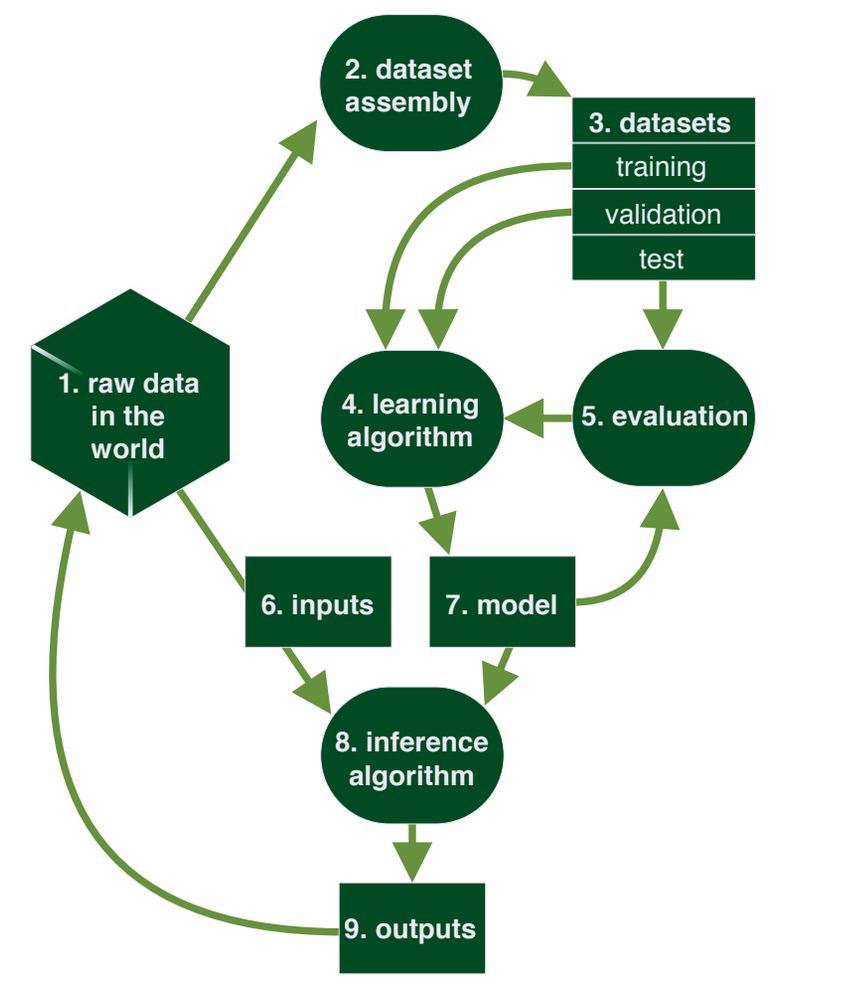
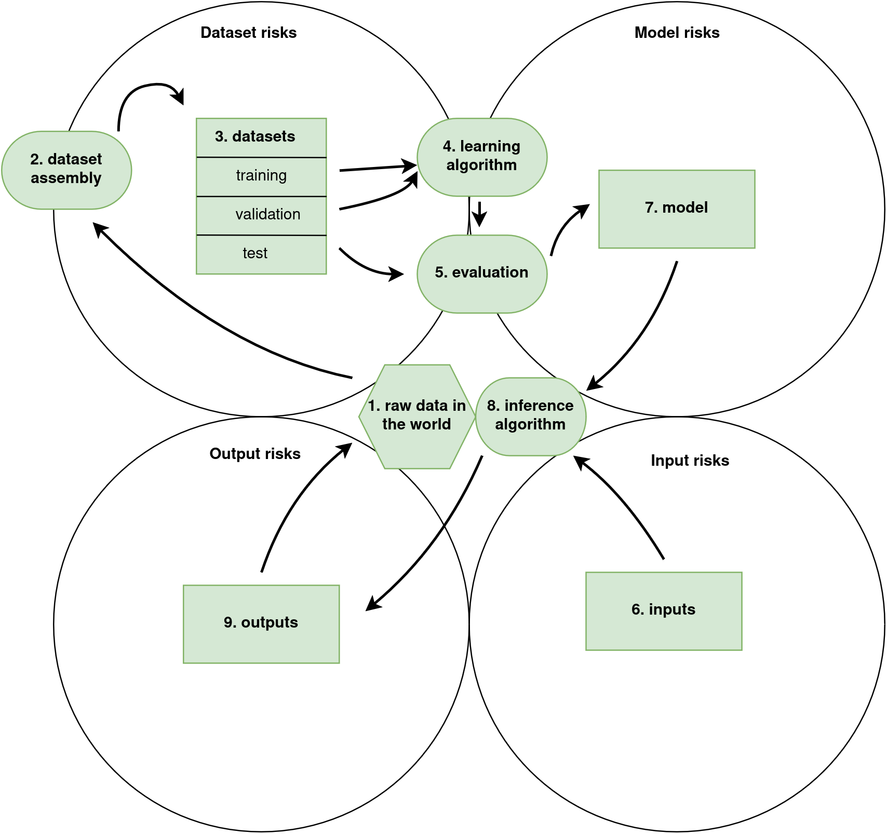

# The DIMO framework in Elevation of MLsec
This file goes through the framework we have constructed based on BIML's work to form our four card suits in Elevation of MLsec: Dataset risks, Input risks, Model risks and Output risks (DIMO). For more details, check out the game in the [./game](./game/) folder.

## The source material: BIML architectural risk analysis
To make BIML's architectural risk analysis for machine learning systems (refered to as BIML-78) into a card game, we have introduced a derivative of it into our own simpler framework. Please note that this game is not a comprehensive representation or application of the BIML risk frameworks. We have hand-picked the risks from the BIML risk analysis that we felt fit best in context of this game. We have also pruned several overlaps between components (for example, looping is described in both the input and output components of the BIML framework). 

**Figure 1:** The BIML Risk Framework for a Generic Machine Learning process. Source: https://berryvilleiml.com/interactive/

To see more details on how the BIML framework is mapped into our game, check out [cards.yaml](./game/cards.yaml), as every card references its origin identifier from the source material, and [risk-frameworks.md](./ml-risk-frameworks/risk-frameworks.md).

## Introducing the DIMO framework in Elevation of MLsec

To make the BIML risk framework apply for a card game, we have simplified the BIML risk framework in a way so that it falls into four risk categories (termed with suits in context of the game): Dataset risk, Input risk, Model risk and Output risk, appreviated with a suggested mnemonic of DIMO. In the DIMO framework we form our suits from four *things* (rectangulars in the BIML framework): an ML model, its datasets, inputs and outputs. We consider the ovals (and the polygon) and processes or data that form *interfaces* between the *things*. Therefore they can be considered risks of the things, depending on which interface (and which part of it) they lie in. Risks about the system as a whole can also be isolated to one component in our context as it usually is most present in one of the components. This recategorization allows us to put risks from all 9 components (and the system component) into a framework consisting of only four suits, which fits well into the four card suits that consistute a 52 card deck.

**Figure 2:** The DIMO framework in Elevation of MLsec, as a simplified version of the BIML risk framework.

In this customized and simplified version of the BIML risk framework, we collect all the 9 components of the BIML risk framework into four categories, which form our four card suits. The four things (3. Datasets, 6. Inputs, 7. Model, 9. Outputs) lie exclusively within their suit, while the interfaces (1. Raw data in the world, 2. Dataset assembly, 4. Learning algorithm, 5. Evaluation, 8. Inference algorithms) and the system as a whole may appear in several suits.

The BIML components are mapped in the following way into DIMO: 

| DIMO card suit | BIML component    |
|-------------------|----------------------------|
| Dataset risk   |   1. Raw data in the world*  2. Dataset assembly*    3. Datasets   4. Learning algorithm* 5. Evaluation*       |
| Input risk   |   1. Raw data in the world*    6. Inputs        8. Inference algorithm*    |
| Model risk      | 4. Learning algorithm* 5. Evaluation*  6. Model   8. Inference algorithm*       |
| Output risk    | 8. Inference algorithm*    9. Outputs  |

 \* Components marked with an asterisk (\*) may appear in several DIMO risk categories, as they in a sense form interfaces between two things.

As LLM risks are formed around the same risk framework (which is formulated based on a generic ML lifecycle), risks originating from the BIML-LLM-24 risk framework fit well into the same categories.

### Caveats

Simplifying the BIML framework in this way is prone to sacrificing details and nuances that may be important to consider in a risk analysis process. Also, it's important to note that this game is not a comprehensive representation or application of the BIML architectural risk frameworks. We have hand-picked the risks from the BIML risk analyses that we felt fit best in context of this game. Only 50 out of 78 generic BIML risks and 81 BIML-LLM risks are present in this game (although BIML has several redundant risks in their framework). We consider the OWASP top 10 for LLMs fully covered by the BIML risks included, also with the two from their LLM top 10 list. 

Therefore we recommend that you always have the BIML framework at hand and think carefully about how card-oriented risks apply when considering the "full" framework. The risks in the game have not been rigorously ordered based on any weighting of how important the risks are. The ordering is generally rather arbitrary (although the for J-K cards we have attempted to choose important risks based on BIML's lists).